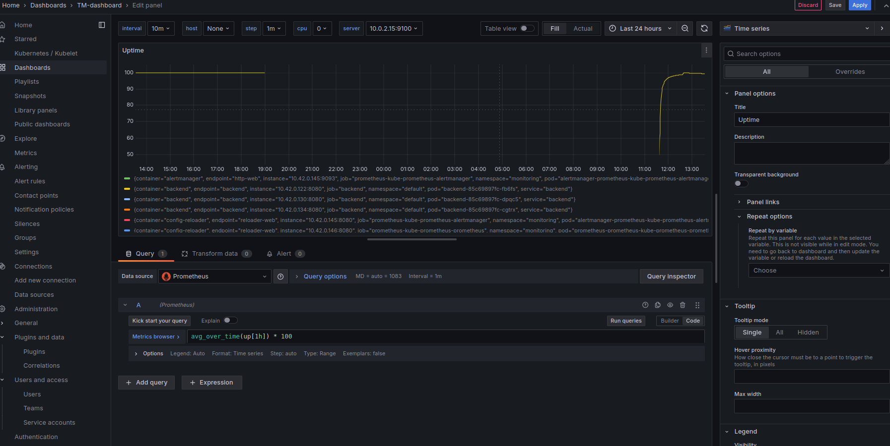
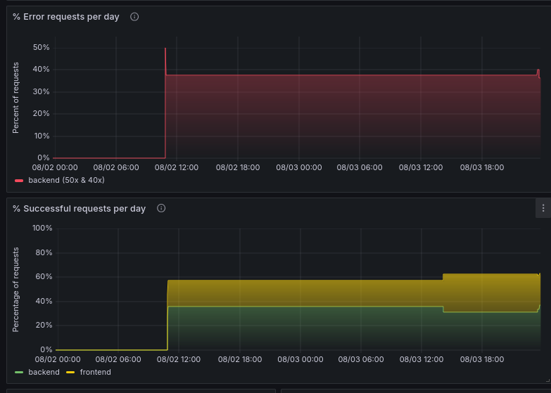

**Note:** For the screenshots, you can store all of your answer images in the `answer-img` directory.

## Verify the monitoring installation

*TODO:* run `kubectl` command to show the running pods and services for all components. Take a screenshot of the output and include it here to verify the installation


## Setup the Jaeger and Prometheus sourcePanel Title
*TODO:* Expose Grafana to the internet and then setup Prometheus as a data source. Provide a screenshot of the home page after logging into Grafana.


## Create a Basic Dashboard
*TODO:* Create a dashboard in Grafana that shows Prometheus as a source. Take a screenshot and include it here.



## Describe SLO/SLI
*TODO:* Describe, in your own words, what the SLIs are, based on an SLO of *monthly uptime* and *request response time*.

ANSWER: SLOs are specified maximum or minimum targets that an SLI metric should not exceed or not fall below within a given period. Ex. the average  uptime(metric) shld be 99.9% within the month May or 98% of the average request response time shld be under 10ms within the year is an SLO while the measure of the actual metrics, say the system had a 95% uptime within a that month or 93% of requests within the year were under 10ms. In essence the actual score is the SLI

## Creating SLI metrics.
*TODO:* It is important to know why we want to measure certain metrics for our customer. Describe in detail 5 metrics to measure these SLIs. 

General metrics
Latency - 
the slo wld be to get a 99% average response time less than 15ms within the month - This refers to the time it takes for a request to get response.

Availability - 
This refers to the readiness of a system. This could be the percentage of 2x or 3x responses out of the total responses. the slo is to get 99.9% ok responses in a month

Uptime - 
The refers to the amount of time the system is up. the sli would be to try to get 99.9% uptime in a month

Failures
This sli would try to get 0.01% percentage amount of 5x or 4x errors in a month

CPU, Memory and Network capacity

Average CPU usage should be less than 70% this month
Average memory usage should be less than 70% this month


## Create a Dashboard to measure our SLIs
*TODO:* Create a dashboard to measure the uptime of the frontend and backend services We will also want to measure to measure 40x and 50x errors. Create a dashboard that show these values over a 24 hour period and take a screenshot.



## Tracing our Flask App
*TODO:*  We will create a Jaeger span to measure the processes on the backend. Once you fill in the span, provide a screenshot of it here. Also provide a (screenshot) sample Python file containing a trace and span code used to perform Jaeger traces on the backend service.


## Jaeger in Dashboards
*TODO:* Now that the trace is running, let's add the metric to our current Grafana dashboard. Once this is completed, provide a screenshot of it here.


## Report Error
*TODO:* Using the template below, write a trouble ticket for the developers, to explain the errors that you are seeing (400, 500, latency) and to let them know the file that is causing the issue also include a screenshot of the tracer span to demonstrate how we can user a tracer to locate errors easily.

TROUBLE TICKET

Name: Ayotomiwa Salau

Date: 03/08/24

Subject: Error `500`

Affected Area: from emdpoint `/throwerr`

Severity: High

Description: We are seeing 30% error rate per day from the api above with this log
```
name 'requests' is not defined
File "/app/app.py", line 85, in no_exist
    res = requests.get('https://jobs.github.com/positions.json?description=python')

```
Kindly resolve the error in the `backend` application as soon as possible 

## Creating SLIs and SLOs
*TODO:* We want to create an SLO guaranteeing that our application has a 99.95% uptime per month. Name four SLIs that you would use to measure the success of this SLO.

- average uptime per month
- no of successful requests per minute 
- no of error requests per minute
- average response duration per month
- average cpu, memory, disk and network usage per month

## Building KPIs for our plan
*TODO*: Now that we have our SLIs and SLOs, create a list of 2-3 KPIs to accurately measure these metrics as well as a description of why those KPIs were chosen. We will make a dashboard for this, but first write them down here.

- 99.9% uptime per month 
This metric ensures high availability, allowing for minimal downtime and maintaining user trust in critical services.
- average response time in a month will not exceed < 300ms
Setting this threshold guarantees a fast user experience, as responses within 300ms are generally perceived as immediate and engaging.
- 99.9% ok responses and 0.01% error response per minute
This metric emphasizes reliability, aiming for a high success rate in user requests to minimize disruptions and maintain operational efficiency.
- average cpu usage in a month should not exceed 85%
Limiting CPU usage to 85% prevents system overload, ensuring sufficient processing power for peak demands and maintaining performance.
- average memory usage in a month should not exceed 85%
This threshold ensures the system has enough memory resources to handle concurrent processes, preventing crashes and slowdowns.
- average disk usage in a month should not exceed 75%
Keeping disk usage under 75% allows for data growth and system operations, reducing the risk of running out of storage and ensuring efficient performance.

## Final Dashboard
*TODO*: Create a Dashboard containing graphs that capture all the metrics of your KPIs and adequately representing your SLIs and SLOs. Include a screenshot of the dashboard here, and write a text description of what graphs are represented in the dashboard.  


### Uptime per Month
Uptime per month measures the percentage of time a system or service is available during a 30-day period. A 99.9% monthly uptime target allows for just under 44 minutes of downtime per month.
### Average Response Duration
Average response time measures the time it takes for a system to respond to a request. Keeping the average response time under 300ms ensures a fast and responsive user experience.
### Successful vs Error Responses
The percentage of OK vs error responses indicates the reliability of a system. Aiming for 99.9% OK responses and only 0.01% errors per day demonstrates a highly stable and well-functioning system.
### CPU Usage
CPU usage measures the percentage of a system's processing power being utilized. Keeping the average CPU usage under 85% per month leaves headroom for handling spikes in traffic or processing.
### Memory Usage
Memory usage measures the percentage of a system's RAM being consumed. Maintaining average memory usage below 85% per month prevents the system from running out of memory and crashing.
### Disk Usage
Disk usage measures the percentage of a system's storage space being occupied. Keeping average disk usage under 75% per month allows room for growth and avoids running out of disk space.


